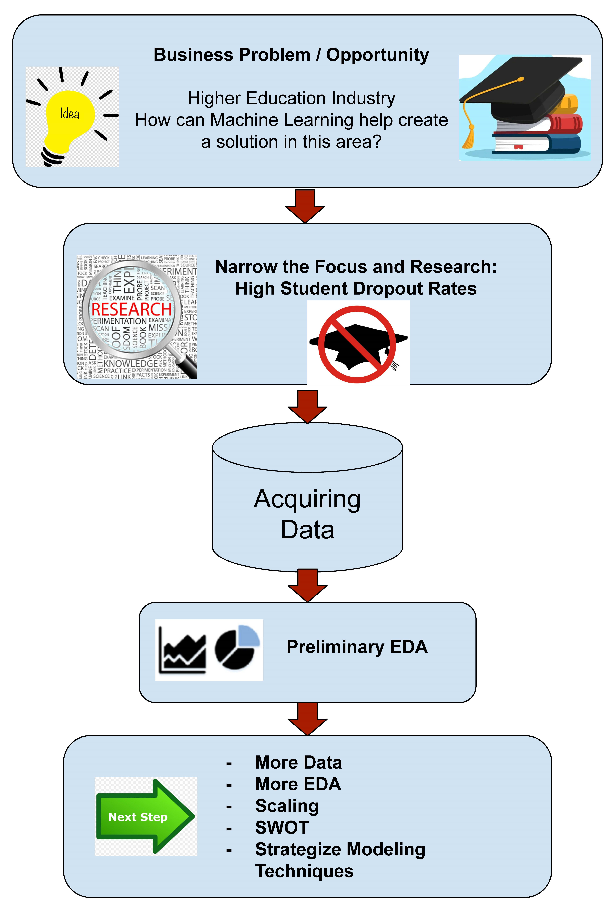

  
Table of Contents

  <ol>
    <li><a href="#project-overview">Project Overview</a></li>
    <li><a href="#project-flowchart">Project Flowchart</a></li>
    <li><a href="#project-organization">Project Organization</a></li>
    <li><a href="#dataset">Dataset</a></li>
    <li><a href="#credits-and-references">Credits And References</a></li>

  </ol>

<!-- Project Overview -->
## Project Overview

Student Retention Model
=========================

**Identifying At-Risk Students for dropping out of college**

Given the right set of data of a student population consisting of both college drop outs and graduates, can we leverage predictive analytics to forecast student withdrawal actions?

(<a href="#readme-top">back to top</a>)

<!-- ### Walkthrough Demo -->

### Project Flowchart
 

  

(<a href="#readme-top">back to top</a>)

### Project Organization

* `data` 
    - [PreData.csv](https://drive.google.com/file/d/1g-bVWHObcPFhSpUs4lNxAriqcH9iOHoS/view?usp=drive_link)
    - [Data Dictionary](PreDataDataDictionary.xlsx)
<!-- 
* `model`
    - joblib dump of final model / model object -->

* `notebooks`
    - [Preliminary EDA](Sprint1PreliminaryEDA.ipynb)
<!-- 
* `reports`
    - contains final report which summarises the project -->

* `references`
    - [Sprint 1 Presentation Slides](CapstoneSprint1StudentRetentionModel.pptx)
<!-- 
* `src`
    - Contains the project source code (refactored from the notebooks)

* `.gitignore`
    - Part of Git, includes files and folders to be ignored by Git version control

* `capstine_env.yml`
    - Conda environment specification

* `Makefile`
    - Automation script for the project
-->
* `README.md`
    - [ReadMe](README.md)
<!-- 
* `LICENSE`
    - Project license -->

### Dataset
    Historical anonymized data of enrolled students spanning 10 years containing some features about the student that will hopefully support insights on the predictability of academic withdrawal or not.  

### Credits And References

* [Learnopoly College Dropout Rate Statistics](https://learnopoly.com/college-dropout-rate/)
* [Educationdata.org College Dropout Rates](https://educationdata.org/college-dropout-rates)

<!-- CONTACT -->
### Contact
Bobbie318808 - bobbie318808@gmail.com

Project Link: [https://github.com/bobbie318808/Student-Retention-Model](https://github.com/bobbie318808/Student-Retention-Model)

(<a href="#readme-top">back to top</a>)

